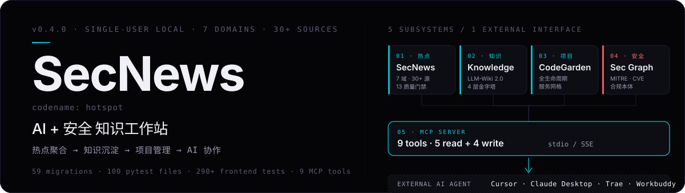
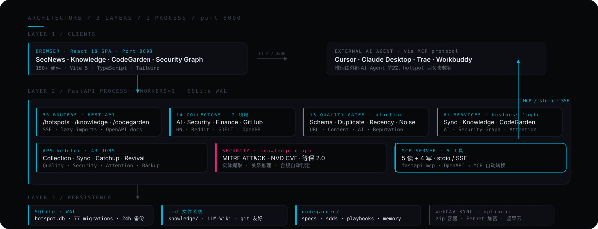
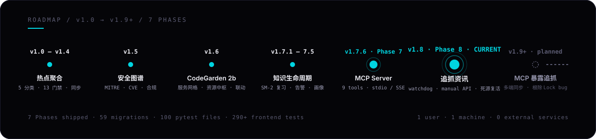

# SecNews · AI + 安全 知识工作站

<p align="center">
  
</p>

<p align="center">
  <code>v1.8</code>&nbsp;·&nbsp;<code>Python 3.10+</code>&nbsp;·&nbsp;<code>React 18</code>&nbsp;·&nbsp;<code>SQLite WAL</code>&nbsp;·&nbsp;<code>MCP 13 tools</code>&nbsp;·&nbsp;<code>GPL-3.0</code>
</p>

> **SecNews**（开发代号 `hotspot`）是面向 **AI + 安全从业者** 的单人本地工作站。
> 把每天的「**热点聚合 → 知识沉淀 → 项目管理 → AI 协作**」合并到一台机器，
> 通过 **MCP 协议** 开放 **13 个工具** 给 Cursor / Claude Desktop / Trae 等外部 AI Agent。
>
> 一个人 · 一台电脑 · 零外部服务。

---

## 快速开始

```bash
git clone https://github.com/anyeduke11/secnews.git && cd secnews

# 后端
python -m venv .venv && source .venv/bin/activate
pip install -r backend/requirements.txt
python run.py                        # http://127.0.0.1:8000

# 前端（另一个终端）
cd frontend && npm install && npm run dev   # http://localhost:8898
```

**首装必做**：编辑 `backend/proxy_config.json` 把 `127.0.0.1:7897` 改成你的代理端口（默认模式 `off`）。
`security_collector` 和 `github_collector` 走代理才能拿到数据；可不改，前端设置页可运行时改。

## 5 个子系统

| #  | 子系统                | 解决什么                                                             | 入口                                          |
| -- | --------------------- | -------------------------------------------------------------------- | --------------------------------------------- |
| 01 | **SecNews 热点聚合**  | 7 大领域 · 30+ 数据源 · 13 质量门禁                                 | `/`                                           |
| 02 | **Knowledge LLM-Wiki** | 4 层金字塔 (items → concepts → learning → content)                  | `/knowledge`                                  |
| 03 | **CodeGarden**        | 项目全生命周期 + 服务网格 + 资源中枢 + 联动引擎                     | `/codegarden`                                 |
| 04 | **Security Graph**    | MITRE ATT&CK · NVD CVE · 等保 2.0 / 关基 / 数安法                   | `/knowledge/process`（内嵌图谱）               |
| 05 | **MCP Server**        | 13 个标准工具 · stdio / SSE · 零状态                                | `python -m backend.mcp_stdio_main`            |

### 数据源

| 领域                | 来源                                                                 |
| ------------------- | -------------------------------------------------------------------- |
| 科技 / AI           | AIHOT · AGI Hunt · 小互AI                                            |
| 网络安全            | 阿里云漏洞库 · CNNVD · 安全客 · FreeBuf · THN · 奇安信 · 绿盟 · Sogou 微信 |
| 金融 / 投资         | 新浪财经 · 腾讯证券                                                  |
| 独立开发 / 创业     | Hacker News · Product Hunt                                           |
| GitHub              | GitHub Trending + 搜索                                               |
| 标讯                | 政府采购网（代理爬取）                                                 |
| 知识                | Cubox · 浏览器书签 · SecNews 收藏                                    |

完整列表见 [`backend/collectors/`](./backend/collectors)。

## 架构

<p align="center">
  
</p>

## MCP Server

13 个标准工具，外部 AI Agent 自动发现：

| 读 (5)                                                       | 写 (8)                                                                  |
| ------------------------------------------------------------ | ----------------------------------------------------------------------- |
| `search_hotspots` · `get_hotspot` · `list_favorites`         | `add_favorite` · `remove_favorite` · `add_annotation`                   |
| `search_knowledge` · `get_personal_profile`                  | `update_knowledge_item` · `trigger_extract_tags` · `trigger_cubox_sync` |
|                                                              | `create_alert_rule` · `mark_digest_read`                                |

stdio 配置（粘到你的 AI Agent 配置文件）：

```json
{
  "mcpServers": {
    "hotspot": {
      "command": "python",
      "args": ["-m", "backend.mcp_stdio_main"],
      "cwd": "/绝对路径/secnews"
    }
  }
}
```

| AI Agent         | 配置文件路径                                                  |
| ---------------- | ------------------------------------------------------------- |
| Claude Desktop   | `~/Library/Application Support/Claude/claude_desktop_config.json` |
| Trae             | `~/.trae/mcp_config.json`                                     |
| Cursor           | `~/.cursor/mcp.json`                                          |
| Claude Code      | 项目根目录 `.mcp.json`                                        |

启动 AI Agent 后直接说「给我列最近 24h 的安全热点」即可。

## 技术选型

| 组件        | 选型                              | 理由                                                  |
| ----------- | --------------------------------- | ----------------------------------------------------- |
| Web 框架    | FastAPI                           | async + OpenAPI 生态成熟                              |
| 主存储      | **SQLite WAL** + `.md` 文件       | 零部署 · FTS5 · git 友好 · LLM 可直读                |
| 调度        | APScheduler · 31 jobs             | 单进程内调度，无外部 MQ                               |
| MCP         | fastapi-mcp                       | OpenAPI → MCP 自动转换                                |
| 前端        | React 18 + Vite 5 + TypeScript    | 60+ 组件 · 类型安全 · 热重载                          |
| 图表        | echarts + recharts                | 看板风格                                              |
| 加密        | Fernet (PBKDF2 派生)              | secrets · 同步包                                      |
| 跨端同步    | WebDAV (坚果云) · zip 容器        | 加密包最小化 · 不依赖云服务                            |

## 路线图

<p align="center">
  
</p>

## 测试

```bash
# 后端（67 个 pytest 文件）
.venv/bin/python3 -m pytest backend/tests/ -v
.venv/bin/python3 -m pytest backend/tests/ -k "merge"
.venv/bin/python3 -m py_compile backend/services/sync_merge.py

# 前端（Vitest + jsdom）
cd frontend
npx vitest run
npx tsc --noEmit
npm run build
```

CI: `.github/workflows/ci.yml` — Python compile + pytest + tsc + vitest + vite build。

## 常见问题

**Q: 为什么不内置 LLM 推理？**
A: 让用户在自己已配好的 AI Agent 环境（Cursor / Claude Desktop / Trae）中推理，避免重复配置和 API key 管理。hotspot 只负责数据存储 + 13 工具暴露。

**Q: 能多用户吗？**
A: 当前是单用户本地工作站，无多用户/权限隔离。SQLite WAL 模式下 `WORKERS=1` 是约束条件。

**Q: 数据怎么备份？**
A: 3 选 1：
1. `backend/data/backup_*.db`（24h 滚动，APScheduler 自动）
2. WebDAV 同步包（坚果云 · zip + Fernet 加密）
3. git 跟踪 `knowledge/` 目录

**Q: 端口冲突怎么办？**
A: 后端改 `PORT=8001` 启动；前端改 `vite --port 8899`。**8898 是受保护端口**（CodeGarden 资源中枢），禁止释放。

## 贡献

新源 → 继承 `BaseCollector` + 测试
新门禁 → 继承 `BaseGate` + 进 `pipeline.py`
新 MCP tool → `mcp_types.py` 加 Pydantic + `mcp_config.py` 加 operation_id

详细：[`AGENTS.md`](./AGENTS.md) · [`CLAUDE.md`](./CLAUDE.md) · [`docs/IMPROVEMENT_PLAN.md`](./docs/IMPROVEMENT_PLAN.md)

**禁止**：
- 提交 `.env` / 真实 proxy 配置 / 个人数据
- 引入 Redis / PostgreSQL / Celery（违反「简单胜过复杂」原则）
- 多 worker（SQLite WAL 锁限制）

## 许可证

[LICENSE](./LICENSE) — GNU GPL-3.0

---

## English

**SecNews** (codename `hotspot`) is a **single-user local workstation for AI + security practitioners**.
It unifies daily workflows — news aggregation, knowledge capture, project lifecycle — into one local
machine and exposes them to external AI Agents via the standard **MCP protocol** with **13 tools**.

> One person · one machine · zero external services.

### Quick start

```bash
git clone https://github.com/anyeduke11/secnews.git && cd secnews
python -m venv .venv && source .venv/bin/activate
pip install -r backend/requirements.txt
python run.py                          # http://127.0.0.1:8000
cd frontend && npm install && npm run dev   # http://localhost:8898
```

Configure `backend/proxy_config.json` (set your proxy port, default mode `off`).

### MCP stdio config

```json
{
  "mcpServers": {
    "hotspot": {
      "command": "python",
      "args": ["-m", "backend.mcp_stdio_main"],
      "cwd": "/absolute/path/to/secnews"
    }
  }
}
```

### License

[LICENSE](./LICENSE) — GNU GPL-3.0