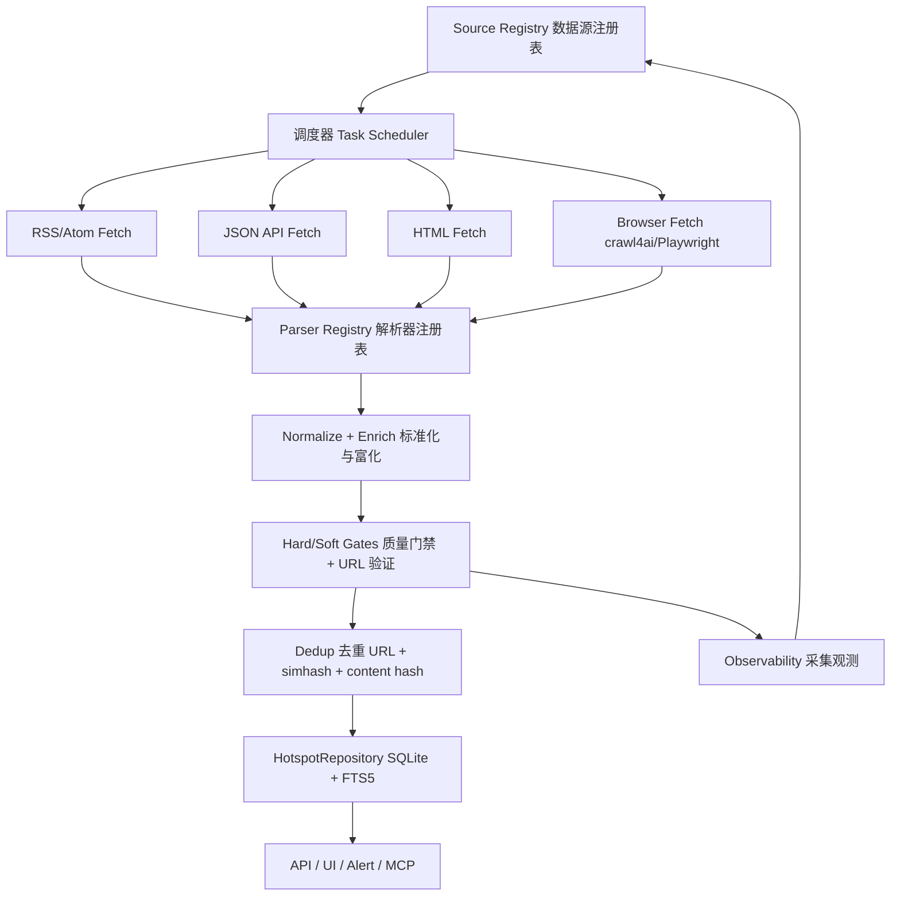

# SecNews 爬虫体系 v2 设计架构与技术方案

> 状态：设计稿，待评审
> 日期：2026-08-01
> 范围：资讯与标讯的采集、解析、质检、去重、入库、调度、运维
> 原则：真实优先、结构化优先、增量优先、健康自愈、本地优先

## 1. 设计目标与验收口径

| 目标 | 含义 | 可量化口径 |
|------|------|-----------|
| 准确 | 只收录真实、可达、与标题内容一致的原文 | 原文 URL 硬校验通过率 ≥ 98%，DB 中不存在首页/列表/搜索/占位 URL |
| 及时 | 从源站发布到系统可见的时间尽量短 | 资讯 P95 ≤ 15 分钟，标讯 P95 ≤ 30 分钟 |
| 有效 | 只保留目标用户关心的资讯与标讯，并提供可用元数据 | 网安标讯元数据覆盖率 ≥ 80%，跨源重复率 ≤ 5%，源活跃率 ≥ 80% |
| 可维护 | 单源改版时 15 分钟内可修复，不再靠正则猜结构 | 每个源独立 parser + 版本号 + 独立测试 |
| 自愈 | 死源自动退避，恢复后自动复活 | 连续失败自动冷却，复活探测成功后自动重新加入调度 |

## 2. 现状审计

### 2.1 现有采集链路

```text
BaseCollector.collect()
  -> FetchersMixin.fetch_source()
       rss_url / renderer=json / renderer=sogou / crawl4ai / aiohttp
  -> _parse_html / _parse_json
  -> ItemBuilderMixin._build_items()
       title/URL 过滤、published_at 硬校验、本周一时效门禁
  -> QualityGatesMixin._run_quality_gates()
       Schema/Recency/Content/Noise/Category/Title/URL/Reputation/Author/FinalUrl/Duplicate/BidRecency
  -> CollectionService.run_once()
       asyncio.gather 并发 collector -> simhash 去重 -> upsert -> trend/FTS/export 链
  -> HotspotRepository.upsert_many()
```

### 2.2 现网数据快照（2026-08-01）

| 指标 | 观测值 |
|------|--------|
| `source_stats` 来源 | 120 个 |
| 来源健康分布 | active 41 / stale 2 / dead 77 |
| `bid` 最近 14 天产出 | 0 条 |
| `bid` 最近一次有产出的来源 | 2026-07-08 前后 |
| `security` 本周活跃来源 | 主要是 RSS 与搜狗公众号路径，多数监管/厂商直连源 dead |
| `hotspots` 当前表内行数 | 1098 行 |
| 数据库体积 | 约 1.2 GB，历史计数与当前表口径存在明显漂移 |

### 2.3 根因分析

| 问题 | 根因 | 影响 |
|------|------|------|
| 标讯大面积失败 | 50+ 来源硬编码在 `bid_collector.py`，多数是首页 URL；`aiohttp` 直连遇 404/412/521/DNS/超时 | 标讯分类实际无数据 |
| 标讯不准确 | 历史 `bid_search.py` 以 Bing 搜索为主路径；搜索结果数量、时效、稳定性都不可控 | 无法保证原文与发布时间 |
| 标讯无结构化 | 只有标题、URL、摘要；缺少项目编号、采购人、预算、截止时间、地区、行业 | 无法做告警、排序、过滤 |
| HTML 解析脆弱 | `_parse_html` 默认抓所有 `<a>` + 正则；无每个站点的独立 parser | 站点改版即抓错或全断 |
| RSS 路径不稳 | `feedparser.parse(url)` 内部直连，无统一 UA/代理/超时/重试 | RSS 源也容易空、卡死 |
| Crawl4ai 未真正落地 | 默认关闭；`crawl4ai_client.py` 与 `crawl4ai_parser.py` 两套实现未统一；BidCollector 又有自己的包装 | JS/反爬源没有可靠兜底 |
| 调度无差异化 | 所有源统一 5 分钟全量跑；死源反复被重试，活跃源没有增量语义 | 浪费资源且时效不稳定 |
| 质量门禁偏宽松 | `quality.strict_mode` 默认 false，只扣分不拒收；去重上下文只读最近 200 条 | 低质量/重复数据仍可能入库 |
| URL 验证不足 | `url_content_check` 默认抽样 10%，`FinalUrlGate` 用同步 `urllib` | 大量 URL 状态停在 pending，无法保证原文可达 |
| 无原始内容缓存 | 没有 raw content / content_hash 持久化 | 无法做正文级校验、去重、重新解析 |
| 可观测性漂移 | `source_stats` 的历史计数与 `hotspots` 当前表不一致 | 健康报告不可信 |

## 3. 目标架构



### 3.1 分层职责

| 层 | 职责 | 关键不变量 |
|----|------|-----------|
| 配置层 | 数据源注册、解析器注册、抓取参数、调度频率 | 源配置不写死在 collector 代码里 |
| 调度层 | 按源调度、优先级队列、冷却/复活、checkpoint | 一个源失败不阻塞其他源 |
| 抓取层 | RSS/JSON/HTML/JS 渲染，统一 UA/代理/重试/限速 | 返回原始响应 + 元数据，不做业务判断 |
| 解析层 | 每个站点一个 parser，输出统一 `RawItem` | 解析失败不影响抓取结果，单源可独立修复 |
| 标准化层 | 统一时区、URL、分类、正文、摘要、标讯字段 | 下游只消费强类型模型 |
| 质量层 | 硬门禁拒绝、软门禁打分、URL 全量验证 | 原文链接与标题内容必须真实对应 |
| 去重层 | URL 规范化、标题 simhash、正文 content hash | 跨源同一条新闻只保留一份 |
| 存储层 | hotspots + raw_items + source_registry + fetch_runs + bid_details | 原始数据与展示数据分离 |
| 观测层 | 每源每轮产出、错误、延迟、健康、告警 | 健康报告与 DB 当前数据口径一致 |

## 4. 开源技术选型

| 层 | 开源方案 | 用途 | 现状 |
|----|---------|------|------|
| HTTP 客户端 | `httpx` | 异步 HTTP/2、连接池、代理、重试 | 已有 `BackendSession`，但未接入主流采集路径，且 `requirements.txt` 未显式声明 |
| 反爬客户端 | `curl_cffi`（可选） | TLS/JA3 指纹模拟，用于强反爬站点 | 未引入，v2 作为可选依赖 |
| RSS/Atom | `feedparser` | 解析 RSS/Atom | 已有，但改为先 HTTP 抓取再解析，禁止 feedparser 自行联网 |
| HTML 解析 | `lxml` + `selectolax`（可选） | CSS/XPath 选择器、高速 DOM | 已有 `lxml`，v2 统一走解析器注册表 |
| 正文提取 | `trafilatura` | 提取标题、正文、作者、发布时间 | 已有封装，v2 提升为抓取后标准步骤 |
| JS 渲染/反爬 | `crawl4ai` + `playwright` | SPA、政府站、强反爬站点 | 已有，但关闭且两套实现重复，v2 收敛为单一浏览器抓取服务 |
| 重试 | `tenacity` | 指数退避、可观测重试 | 未引入 |
| 调度 | `APScheduler` + `asyncio.PriorityQueue` | 周期任务 + 源级任务队列 | APScheduler 已有，队列新增 |
| 模型/校验 | `pydantic` | `SourceConfig` / `RawItem` / `NormalizedItem` | 已有 |
| 存储 | SQLite WAL + FTS5 | 主存储与全文检索 | 已有 |
| 日志/观测 | `loguru` + `log_event` + 自研健康表 | 结构化事件、源健康、采集审计 | 已有 |

### 4.1 为什么不直接引入 Scrapy

`Scrapy` 是成熟爬虫框架，但它基于 Twisted 事件循环，与 FastAPI/APScheduler 的 `asyncio` 单进程架构集成成本高；当前规模约 50-80 个源，单进程异步抓取足够。v2 采用“Scrapy 式组件化流水线”思想，但运行时保持 FastAPI 单进程。若未来出现多机、高并发、超大规模抓取需求，可把 HTML 抓取下沉为独立 Scrapy/Crawlee worker，通过消息队列对接，架构边界已在 v2 中预留。

## 5. 核心流水线设计

### 5.1 数据源注册表（Source Registry）

源配置统一为结构化数据，可放 YAML + SQLite，代码中只保留默认 seed。

```yaml
- id: ccgp
  name: 中国政府采购网
  category: bid
  kind: html            # rss | json | html | browser | disabled
  parser: bid/ccgp
  url: https://www.ccgp.gov.cn/
  list_url: https://www.ccgp.gov.cn/cggg/zygg/
  cadence_seconds: 1800
  priority: 90
  max_items: 50
  enabled: true
  verify_ssl: false
  use_proxy: auto
  headers:
    User-Agent: SecNewsBot/2.0
```

核心字段：

| 字段 | 说明 |
|------|------|
| `id` | 全局稳定源 ID |
| `kind` | rss / json / html / browser / disabled |
| `parser` | 解析器注册名，未命中时拒绝，不自动走通用正则 |
| `cadence_seconds` | 该源调度周期 |
| `priority` | 调度优先级 |
| `max_items` | 单轮上限 |
| `use_proxy` | off / auto / required |
| `headers` | 每源请求头 |
| `etag` / `last_modified` | 增量抓取缓存 |

### 5.2 源级调度器

不再“每 5 分钟跑全部源”，改为“按源配置调度 + 按健康状态退避”。

规则：

| 规则 | 实现 |
|------|------|
| 基础周期 | 每源读 `cadence_seconds` |
| 失败退避 | 连续失败 3 次 -> `stale`，5 次 -> `dead`，`cooldown_until` 指数增长 |
| 成功恢复 | 一次有产出即回 `active`，重置失败计数 |
| 死源探测 | 每天固定时间 HEAD/GET 探活，恢复后重新入队 |
| 增量抓取 | 记录每源 `since` / `etag` / `last_modified`，只抓新增 |
| 优先级队列 | 高优先级源先执行，同一分类并发度受限 |
| 运行防重 | 全局限流锁 + 每源单实例锁 |

### 5.3 抓取层

#### RSS/Atom

```text
httpx GET(rss_url, timeout, proxy, UA)
  -> HTTP 200
  -> feedparser.parse(bytes)
  -> RawItem(title, url, summary, published_at, author)
```

禁止 `feedparser.parse(url)` 直接联网；HTTP 层必须统一走 `BackendSession`，支持 ETag、If-Modified-Since。

#### JSON API

统一 `renderer=json` 路径：`httpx GET -> resp.json() -> 每个源一个 JSON parser -> RawItem`。

#### HTML

统一流程：

```text
列表页 GET -> SourceParser.parse_list(html)
  -> 得到候选 RawItem(title, url, published_at)
  -> 详情页 GET -> SourceParser.parse_detail(html)
  -> trafilatura 提取正文/时间/作者
  -> 正文校验标题相关度
```

每个源必须至少实现列表解析；详情解析尽量实现。没有独立 parser 的源默认禁用，不允许退回“抓所有 `<a>`”。

#### 浏览器渲染

仅用于 `kind=browser` 或 JSON/HTML 抓取失败且确认需要 JS 渲染的源。统一 `BrowserFetchService`，收敛现有 `crawl4ai_client` / `crawl4ai_parser` / `bid_collector` 三套逻辑：

- 一个 `AsyncWebCrawler` 单例
- 全局并发信号量，默认 3
- 失败后按源配置降级：`browser -> html -> 放弃`
- 开启 `USE_CRAWL4AI=1` 才启用，但仅对需要浏览器渲染的源，不全局开启

### 5.4 解析器注册表

```text
backend/parsers/
├── registry.py            # parser_id -> Parser 映射
├── base.py                # RawItem / BaseParser
├── rss_generic.py         # 通用 RSS parser
├── json_generic.py        # 通用 JSON parser
├── html_generic.py        # 仅允许配置化选择器，不抓全站链接
├── news/
│   ├── ithome.py
│   ├── freebuf.py
│   └── ...
└── bid/
    ├── ccgp.py
    ├── cebpub.py
    └── ...
```

解析器版本化：

```python
class BaseParser:
    parser_id: str
    version: str = "1.0.0"

    def parse_list(self, content: str, source: SourceConfig) -> list[RawItem]: ...
    def parse_detail(self, content: str, item: RawItem) -> RawItem: ...
```

版本变更记录到源配置，站点改版时通过 parser 版本快速定位。

### 5.5 标准化与富化

统一模型：

```python
class RawItem(BaseModel):
    source_id: str
    native_id: str
    title: str
    url: str
    summary: str | None
    content: str | None
    published_at: datetime
    author: str | None
    category: Category
    extra: dict[str, Any] = {}

class BidItem(RawItem):
    bid_no: str | None
    buyer: str | None
    region: str | None
    budget: str | None
    deadline: datetime | None
    bid_status: str | None
    industry: str | None
```

富化步骤：

1. 时间统一为 UTC `datetime`
2. URL 绝对化、去 tracking 参数
3. 标讯状态从标题/正文提取，可叠加可选 LLM 修正
4. 地区/行业/预算/截止时间从详情页结构化提取
5. 摘要优先用 `trafilatura` 正文前 300 字，不再用 RSS 截断摘要

### 5.6 质量门禁

拆分为两层：

| 类型 | 门禁 | 行为 |
|------|------|------|
| Hard gate | Schema、原文 URL、published_at、分类相关、噪声黑名单、重复 | 必须通过，否则拒绝入库 |
| Soft gate | 标题质量、摘要质量、来源信誉、作者、内容相关度 | 扣分，影响排序，不直接拒绝 |

原文 URL 硬校验：

- 必须是 http/https
- 必须命中真实文章页/公告页规则，拒绝首页、列表、tag、search、占位域名
- 必须解析最终跳转 URL
- 必须验证 HTTP 2xx/3xx
- 必须抓详情页并检查标题/正文关键词重叠
- 标讯禁止使用搜索引擎结果作为原文

URL 校验从抽样改为“新条目全量校验 + 已入库条目定时复检”。校验结果写入 `crawl_url_checks`，不再长期停在 `pending`。

### 5.7 去重

三层去重：

| 层 | 算法 | 作用 |
|----|------|------|
| URL | canonicalize_url | 同源同链接 |
| 标题 | simhash + Hamming distance < 5 | 跨源近似标题 |
| 正文 | content hash | 正文级重复，RSS 与详情页混抓场景 |

同 URL 多标题时按 `url_check_status=verified`、来源信誉、非 fallback、抓取时间选 winner，其他条目合并到 winner 的 `related_ids`。

### 5.8 存储模型

新增/扩展表：

```sql
CREATE TABLE crawler_sources (
    id TEXT PRIMARY KEY,
    category TEXT NOT NULL,
    name TEXT NOT NULL,
    kind TEXT NOT NULL,
    parser_id TEXT NOT NULL,
    url TEXT,
    feed_url TEXT,
    api_url TEXT,
    cadence_seconds INTEGER NOT NULL DEFAULT 300,
    priority INTEGER NOT NULL DEFAULT 50,
    enabled INTEGER NOT NULL DEFAULT 1,
    use_proxy TEXT NOT NULL DEFAULT 'auto',
    headers TEXT,
    etag TEXT,
    last_modified TEXT,
    last_fetch_at TEXT,
    last_success_at TEXT,
    last_yield_at TEXT,
    last_error TEXT,
    consecutive_failures INTEGER NOT NULL DEFAULT 0,
    cooldown_until TEXT,
    health_score REAL NOT NULL DEFAULT 1.0,
    status TEXT NOT NULL DEFAULT 'active',
    created_at TEXT NOT NULL,
    updated_at TEXT NOT NULL
);

CREATE TABLE raw_items (
    id TEXT PRIMARY KEY,
    source_id TEXT NOT NULL REFERENCES crawler_sources(id),
    native_id TEXT NOT NULL,
    title TEXT NOT NULL,
    url TEXT NOT NULL,
    summary TEXT,
    content TEXT,
    content_hash TEXT,
    published_at TEXT NOT NULL,
    fetched_at TEXT NOT NULL,
    payload_json TEXT,
    UNIQUE(source_id, native_id)
);

CREATE TABLE crawler_runs (
    id INTEGER PRIMARY KEY AUTOINCREMENT,
    source_id TEXT NOT NULL,
    started_at TEXT NOT NULL,
    finished_at TEXT,
    status TEXT NOT NULL,
    fetched_count INTEGER NOT NULL DEFAULT 0,
    accepted_count INTEGER NOT NULL DEFAULT 0,
    error_msg TEXT
);

CREATE TABLE crawl_url_checks (
    id INTEGER PRIMARY KEY AUTOINCREMENT,
    item_id TEXT NOT NULL,
    url TEXT NOT NULL,
    final_url TEXT,
    status_code INTEGER,
    title_match_score REAL,
    checked_at TEXT NOT NULL
);

CREATE TABLE bid_details (
    item_id TEXT PRIMARY KEY REFERENCES hotspots(id),
    bid_no TEXT,
    buyer TEXT,
    region TEXT,
    budget TEXT,
    deadline TEXT,
    bid_status TEXT,
    industry TEXT,
    published_at TEXT,
    updated_at TEXT
);
```

保留 `hotspots` 作为展示主表，新增 `raw_items` 作为溯源与正文校验数据源；`source_stats` 改为从 `crawler_runs` 聚合，确保与当前 DB 口径一致。

## 6. 标讯专项设计

### 6.1 源分级

| 级别 | 来源类型 | 策略 |
|------|---------|------|
| P0 | 国家级/权威平台 | 官方列表接口或列表页优先，周期 15-30 分钟 |
| P1 | 金融/能源/电信等行业平台 | 优先 RSS/JSON，周期 30 分钟 |
| P2 | 商业聚合平台 | 只作为补充，必须能拿到原始公告 URL，周期 60 分钟 |
| P3 | 搜索引擎发现 | 仅用于人工核验/兜底，不作为自动采集主路径 |

### 6.2 标讯字段

每条标讯必须尽量产出：

| 字段 | 说明 |
|------|------|
| `bid_no` | 项目编号，用于精准去重 |
| `title` | 公告标题 |
| `published_at` | 公告发布时间 |
| `buyer` | 采购人/招标人 |
| `region` | 省/市地区 |
| `budget` | 预算金额 |
| `deadline` | 投标截止时间 |
| `bid_status` | 招标中/变更/终止/中标/成交/询价/比选/其他 |
| `industry` | 金融/能源/医疗/教育/交通/政府等 |
| `original_url` | 官方公告页真实 URL |

### 6.3 标讯时效

不再仅用“本周一”一刀切过滤：

| 状态 | 展示规则 |
|------|---------|
| 招标中且未过截止时间 | 展示 |
| 招标中但已过截止时间 | 标记 `expired` 并隐藏 |
| 中标/成交/终止/变更 | 展示，但降权 |
| 历史过期公告 | 归档，不进入默认列表 |

### 6.4 标讯准确校验

1. 原始 URL 必须为官方公告页，拒绝聚合列表页和搜索页
2. `bid_no` 若存在则作为强去重键
3. 标题/正文必须命中网安关键词体系，并执行非网安黑名单
4. 状态/截止时间从详情页解析，无法解析时标记 `missing_detail`
5. 重要标讯通过告警引擎命中技术栈/关键词后立即推送给用户

## 7. 资讯专项设计

### 7.1 抓取优先级

```text
RSS/Atom -> 官方 JSON API -> 配置化 HTML parser -> browser render -> 放弃
```

### 7.2 分类准确性

- 使用领域关键词 + 负向黑名单
- 综合媒体源（新浪、36氪等）必须走分类关键词过滤
- 安全/AI 专题源在 RSS 层已经限定主题，不再全局宽松放行
- 可选：外部 AI Agent 通过 MCP 对候选条目打分，`ai_scores` 表记录

### 7.3 内容质量

- 详情页 `trafilatura` 提取正文
- 标题与正文词重叠度低于阈值则拒绝
- 摘要使用正文生成，不使用抓取失败后的占位文本
- 正文为空时允许使用 RSS 摘要，但标记 `no_detail_content`

## 8. 观测与运维

### 8.1 采集指标

每源每轮记录：

| 指标 | 来源 |
|------|------|
| fetched_count | 抓取候选数 |
| accepted_count | 通过门禁数 |
| http_status / error | 抓取结果 |
| duration_ms | 耗时 |
| parser_version | 使用的解析器版本 |
| url_check_status | URL 校验状态 |

### 8.2 健康状态机

```text
active --连续失败3次--> stale
stale --连续失败5次--> dead
dead --探活成功--> active
active --单轮产出>0--> active(重置失败计数)
```

### 8.3 告警

- 分类有效源数低于阈值
- 核心 P0 源连续失败
- 单源产出异常偏离基线
- URL 校验失败率异常升高
- 标讯命中用户技术栈/关键词

## 9. 实施路线

| Phase | 内容 | 预计 |
|-------|------|------|
| A | 建立 Source Registry + Parser Registry，迁移现有硬编码源 | 2-3 天 |
| B | 统一 HTTP 抓取与 RSS/JSON 路径，修复 feedparser 联网问题 | 2-3 天 |
| C | 标讯系统重构：官方源列表接口、结构化详情、bid_details | 3-5 天 |
| D | 质量门禁分层 + 全量 URL 校验 + 三层去重 | 2-3 天 |
| E | 源级调度、失败退避、复活、观测指标 | 2-3 天 |
| F | 管理 API/UI、测试、验收 | 2-3 天 |

## 10. 验收指标

| 指标 | 目标 |
|------|------|
| 注册源活跃率 | ≥ 80% |
| 资讯抓取到展示延迟 | P95 ≤ 15 分钟 |
| 标讯抓取到展示延迟 | P95 ≤ 30 分钟 |
| 新条目 URL 全量校验率 | 100% |
| 原文 URL 硬校验通过率 | ≥ 98% |
| 跨源重复率 | ≤ 5% |
| 标讯元数据覆盖率（P0/P1） | ≥ 80% |
| 数据库无合成/搜索/列表 URL | 0 条 |
| 单源改版恢复时间 | ≤ 15 分钟（parser 版本化 + 独立测试） |

## 11. 风险与对策

| 风险 | 对策 |
|------|------|
| 官方源没有公开接口/RSS | 优先列表页 + 详情页解析；商业聚合仅作补充；不退回搜索引擎主路径 |
| 政府/行业站反爬 | 浏览器渲染 + 合理频率 + 代理 + 单源冷却 |
| 强反爬站点关闭 | 健康退避 + 复活探测 + 告警，避免 5 分钟硬重试 |
| 标讯详情页结构复杂 | 每个平台独立 parser + 样本测试 + 字段缺失降级 |
| 历史数据/计数漂移 | 新增 raw_items/crawler_runs 作为权威统计源，清洗 source_stats |
| 引入新依赖 | 全部可选或轻量，保持单进程本地优先 |
