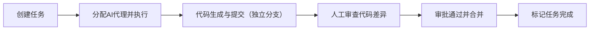
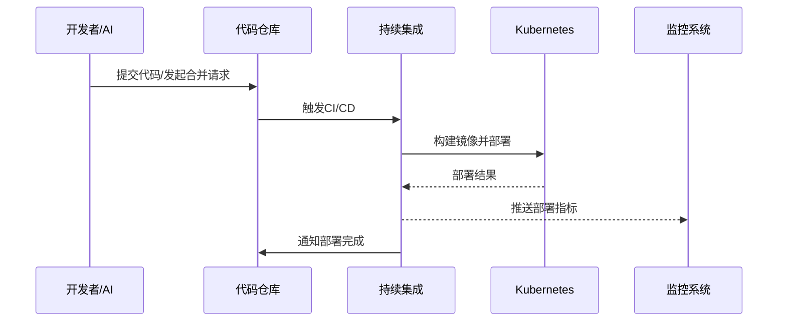

# 看板式全流程系统管理平台设计分析报告

## 执行摘要

氛围编程（Vibe Coding）时代下，开发者通过描述需求让AI自动生成代码，从而实现“指数级”开发效率提升。然而，这种缺乏结构化规范的开发方式也带来了系列问题：任务管理混乱、代码质量不稳定、文档缺失、知识难以沉淀、多人协作困难等。为此，本文提出设计一个面向个人/小团队的**全流程系统化看板管理平台**。该平台以看板为界面，整合代码管理、服务与部署、网络端口管理、系统联动和知识库等功能，并辅以开发技能、开发记忆（知识库）、规范文档（Spec/SDD）与智能提示词管理等模块，实现任务从需求到交付的可视化和可控化。报告将详细分析用户痛点与画像，设计功能模块与数据模型，说明关键交互流程和UI视图，讨论与现有工具（如GitHub/GitLab、Kubernetes、Docker、Prometheus、Grafana、Notion、Obsidian、Claude等）的集成方案，并给出开发辅助（Skill、Memory、提示词等）和规范管理（SDD/Spec模板、版本审计等）的策略。同时，我们提出实施路线图、风险与人力估算，以及不同架构方案对比，以明确首要MVP功能与迭代优先级。

## 用户痛点、目标用户画像与使用场景

- **痛点**：  
  - *任务与流程无序*：使用AI多并行开发时，缺乏统一的任务调度平台，导致多个AI代理任务相互干扰、难以跟踪进度。  
  - *代码质量与可维护性差*：氛围编程过程中，通常未先行编写详细规范，AI“凭感觉”生成代码，容易出现架构设计缺陷、文档缺失和技术债务堆积。  
  - *知识与规范沉淀不足*：个人开发场景下，缺乏集中管理个人知识（开发记忆）、技能经验和提示词素材，导致经验流失、上下文遗忘。  
  - *工具和资源分散*：开发过程中需切换多种工具（IDE、容器、监控、笔记等），个人项目没有统一的工作台，工作生命周期（从需求到部署）无法完整管理。  
  - *AI使用成本与审计压力*：对Anthropic Claude等模型调用缺乏监控和配额管理，提示词和上下文管理不当易导致意料外的资源消耗和结果不稳定。  

- **目标用户画像**：本平台主要面向**AI辅助开发者**，包括**独立开发者/个体程序员**和**小型开发团队**。他们熟悉ChatGPT、Claude等智能助手，擅长用自然语言描述需求，关注开发效率和可视化管理，但目前缺乏配套的个性化开发台。用户通常承担项目全流程角色，从需求分析到部署运维，期望在看板视角下一站式管理任务、代码、服务及知识资产。

- **使用场景与优先级**：  
  1. *单人敏捷开发*：个人开发者利用AI快速迭代功能，需集中管理所有任务和分支，优先实现看板任务管理、代码仓库集成、隔离开发环境。  
  2. *小团队协作*：多成员和多AI代理并行工作，需要任务分配和状态可视化，优先实现多人权限与协作机制、版本控制与审批流程。  
  3. *持续交付与监控*：项目上线后需监控运行服务，可优先集成Kubernetes/Docker部署和Prometheus/Grafana监控，确保任务完成情况和服务健康状态闭环。  
  4. *知识沉淀与复用*：持续开发过程中，需要记录开发经验、提示词和规范模板，以便未来复用；将之作为后期迭代重点模块。

## 功能模块设计

本平台主要功能模块包括：看板任务管理、代码/版本管理、服务部署管理、端口与网络管理、系统联动与监控、开发技能/知识库、提示词与AI调用管理、规范（Spec/SDD）管理和权限控制等。下表列出各模块及其数据模型和主要API契约概览：

- **看板任务管理模块**：基于Kanban视图组织任务（Task），每个任务关联需求描述、所属项目和状态（Todo/InProgress/Review/Done）。数据模型示例：Task(id, title, description, project_id, status, assignee_id, created_at, updated_at)。API契约：提供增删改查任务的REST接口（如POST /tasks, GET /tasks/{id}, PATCH /tasks/{id}/status}等），并支持搜索过滤（按项目、状态、标签等）。权限模型：角色包括管理员（可管理所有任务和项目）、开发者（可创建/更新自己的任务）、审查者（可审核任务到Review状态）、游客（只读）。典型事件流（图1）：开发者在看板创建任务 → AI代理执行代码 → 任务自动转入“进行中” → 人工代码审查 → 任务标记为完成（合并到主分支）。  

- **代码/版本管理模块**：与Git仓库集成，实现每个任务分支隔离开发（可使用Git Worktree或多项目子模块技术）。数据模型示例：Repository(id, name, url), Branch(id, repo_id, name, created_from), Commit(id, branch_id, message, author_id, timestamp)。API契约：调用GitHub/GitLab等API进行操作（见集成方案），支持创建分支、提交代码、查看Diff等。权限模型：通过OAuth/Git凭证控制仓库访问，只有特定角色可触发合并请求（Pull Request）和审批。生命周期：每个任务对应一个独立分支进行开发，开发完成后自动生成PR供审查，通过后合并，并触发看板状态更新。

- **服务与部署管理模块**：记录和管理应用服务（如微服务、容器化应用）及其部署状态。数据模型示例：Service(id, name, image, version, replica_count), Deployment(id, service_id, environment, status, created_at)。API契约：对接Kubernetes/Docker API，实现创建/更新服务、查询部署状态。权限：运维人员或对应开发者可操作。事件：从代码合并触发CI/CD流程（见下文图2），自动生成新的镜像并部署到测试/生产环境，部署结果反馈给任务审查流程。

- **端口与网络管理模块**：维护项目中使用的网络端口、Ingress/Service配置，避免冲突。数据模型示例：Port(id, service_id, port_number, protocol, used). API：通过Kubernetes Ingress/Service配置API或Docker网络API管理端口映射。可视化界面列出每个服务对应的端口和外部访问地址。权限：需谨慎控制，只限管理员修改生产端口配置。事件：当创建新服务或修改端口配置时，检查冲突并更新网络路由。

- **系统联动与监控模块**：提供跨系统的任务依赖及服务健康监控。数据模型示例：Link(id, source_task, target_task, type)，Metric(id, service_id, metric_name, value, timestamp)。API：与Prometheus/Grafana对接，定期从监控系统拉取关键指标（CPU、内存、响应时间等），并在服务详情页展示图表。事件流：根据监控阈值触发告警，可反馈到任务系统生成Issue或任务。

- **开发 Skill/知识库模块**：记录团队/个人开发经验、代码片段、架构设计等“开发记忆”。数据模型示例：Knowledge(id, title, content, tags, author_id, created_at)。API：支持 CRUD 知识条目、全文检索。可集成Obsidian/Notion：如本地Obsidian数据库插件管理Markdown笔记，或调用Notion API管理在线文档。权限：团队知识公开可见，私有笔记仅创建者可见。交互：支持双向链接、标签分类，实现“第二大脑”式知识检索。

- **提示词与AI调用管理模块**：管理Prompt库和AI模型调用。数据模型示例：Prompt(id, text, description, tags), ModelUsage(id, model_name, user_id, tokens_used, date)。API契约：对接AI模型的调用接口（如Claude Code CLI/Anthropic API），并实时记录使用量。权限：所有用户可浏览公共提示词，创建和编辑则受限。功能包括：提示词推荐（基于任务标签自动匹配过往有效提示）、调用限额管理（如每天或每周的Token/请求数上限）。例如，如果当前会话上下文过长，可自动拆分或总结历史上下文，推荐节省token的方案。

- **规范（Spec/SDD）管理模块**：管理项目规范文档（Spec）和软件设计文档（SDD）。每个任务或功能建立对应的规范记录。数据模型示例：Spec(id, project_id, version, content, author_id, status), SDD(id, spec_id, version, content)。API：采用Markdown/JSON存储规范，可通过Git版本控制或Wiki同步。权限：编写规范需要相应角色（如架构师、产品），审核后方可作为“事实来源”。流程：在任务创建前，先书写或引用已有规范；在任务完成前，先审核规范无误（见[50]），然后执行AI生成代码，最后将结果与规范匹配验证。

## 数据库表格设计

以下示例表格展示了部分关键表的字段设计：

| 表名        | 字段              | 类型            | 描述                               |
| ---------- | ----------------- | -------------- | ---------------------------------- |
| **user**   | id                | bigint         | 用户唯一ID，主键                    |
|            | name              | varchar(50)    | 用户名                              |
|            | role              | varchar(20)    | 角色（如admin/dev/reviewer）         |
|            | quota_tokens      | int            | AI调用剩余额度（例如Claude tokens）    |
| **project**| id                | bigint         | 项目ID，主键                        |
|            | name              | varchar(100)   | 项目名称                            |
|            | repo_url          | varchar(255)   | 代码仓库地址                        |
| **task**   | id                | bigint         | 任务ID，主键                        |
|            | project_id        | bigint         | 所属项目ID                          |
|            | title             | varchar(255)   | 任务标题                            |
|            | description       | text           | 任务描述                            |
|            | status            | varchar(20)    | 状态（Todo/InProgress/Review/Done） |
|            | assignee_id       | bigint         | 负责人用户ID                        |
|            | branch            | varchar(100)   | 对应的Git分支名                     |
| **service**| id                | bigint         | 服务ID，主键                        |
|            | project_id        | bigint         | 所属项目ID                          |
|            | name              | varchar(100)   | 服务名称                            |
|            | image             | varchar(255)   | Docker镜像或K8s部署标识             |
|            | ports             | varchar(50)    | 端口映射（如 “80:8080”）           |
| **knowledge**| id              | bigint         | 知识库条目ID，主键                  |
|            | title             | varchar(100)   | 条目标题                            |
|            | content           | text           | 内容（Markdown文本）                |
|            | tags              | varchar(255)   | 标签列表                            |
|            | author_id         | bigint         | 创建者用户ID                        |
|            | created_at        | datetime       | 创建时间                            |

*注：以上仅为示例字段，实际设计需根据功能需求进一步细化。*

## UI/看板关键视图与交互流程

平台主要UI包括**看板视图**、**任务详情/审查页**、**服务运行页**、**知识库浏览**等。看板视图（图1）展示了多个列（Todo、In Progress、In Review、Done），开发者可拖拽任务卡片改变状态。每张任务卡片显示标题、负责人、执行AI模型等信息。点击任务可进入详情界面，展示该任务的规范摘要、描述、AI生成的代码Diff、审查评论和测试结果。审查界面实时显示代码对比，开发者可逐行确认变更。服务运行页列出所有部署的服务实例及其健康指标图表，支持单击查看Kubernetes Pod详情或Grafana监控（集成Prometheus数据）。知识库视图提供以卡片或表格形式展示笔记（可参考Obsidian数据库视图），支持全文搜索、标签过滤。交互流程示例：**开发者在看板创建新任务** → **为任务分配提示词并启动AI代理** → **系统自动打开新Git工作区并运行AI生成** → **生成完成后跳转到任务审查页，人工查看Diff** → **确认无误后点击“合并”并标记任务Done** → **触发CI/CD部署并更新服务健康状况**。

 *图1：任务看板视图示意（列示Todo/InProgress/InReview/Done等列）*

## 工具集成方案与接口

为避免重复造轮子，本平台重点集成当前主流工具和平台：

- **GitHub/GitLab**：集成代码仓库和Issue管理。使用其REST API进行分支、提交、PR/合并等操作。参考官方文档，如GitHub REST API和GitLab API文档（例：https://docs.gitlab.com/ee/api/）。优先集成GitHub（开源社区丰富）和GitLab（私有部署友好）。  
- **Kubernetes/Docker**：负责容器编排和服务运行。通过Kubernetes官方API管理Deployment、Service、Ingress等资源；可调用kubectl命令行或Client-go库。Docker引擎也可通过HTTP API进行容器镜像管理。优先使用云原生K8s集群，对资源进行自动扩缩、滚动升级；Docker API用于本地/小规模场景。  
- **Prometheus/Grafana**：监控平台。Prometheus负责采集和存储时序指标（Pod资源、请求延迟等），Grafana用于可视化。这些均有中文文档支持，Grafana官方教程中文版。集成Prometheus的Alertmanager可在异常时自动创建任务或通知团队。  
- **Notion/Obsidian**：知识管理。Notion提供官方API（https://developers.notion.com/）可读取和写入页面/数据库，适合团队在线协作；Obsidian本地应用可通过Markdown插件或数据库（Bases）实现知识组织。建议两个并用：公共知识用Notion，个人笔记用Obsidian。  
- **Anthropic Claude (AI Agent)**：智能编程助手。集成Claude Code CLI或Anthropic API调用AI生成代码。由于Claude的上下文窗口可达到数万token，平台可通过合理分片和历史摘要技术高效利用上下文。管理调用配额（tokens/天）并根据项目需求动态选择模型版本。  

各集成方案优先级由高到低依次为：代码仓库（核心）、AI代理、容器编排监控、知识库。集成接口链接示例（中文/官方文档）：  
- GitHub API、GitLab API 文档(见[GitLab仓库文件接口])。  
- Kubernetes API 中文文档（也可参考官方英文API参考）。  
- Docker Engine API 简介。  
- Prometheus/Grafana 官方文档（Grafana中文教程）。  
- Notion API (官网)；Obsidian 官方帮助。  
- Claude Code Docs (英文)或国内相关使用教程，管理OpenAI/Claude调用令牌策略。  

## 开发Skill、Memory与提示词管理

为了辅助开发效率和知识沉淀，平台设计如下策略：  
- **开发Skill学习**：集成在线教程或内置知识库，记录最佳实践和代码示例。可为常见任务（如用户认证、支付系统）提供“Skill卡片”，包含概要、示例代码和相关提示词。  
- **开发Memory（知识库）**：允许用户保存代码片段、架构图、工具配置等，支持标签分类和全文检索。与Obsidian/Notion互通，确保学习成果可重复利用。知识库所有数据采用Markdown/数据库存储，可版本管理和历史回溯。  
- **提示词管理**：建立Prompt库，记录高效提示词模板。系统可根据任务类型自动匹配相关提示并展示参考用法。用户可收藏/评分提示词，逐步形成团队共享的“Prompt Engineering”经验。  
- **AI调用配额与上下文管理**：对接Claude等模型时，需要控制token使用。建议设置每日/每项目的调用配额，并监控已用量。上下文管理方面，可通过「摘要+新Prompt」的方式拆分对话，或使用专门的上下文缓存策略。当单个任务对话过长时，可智能总结对话历史，只保留要点转入新会话，确保不超出窗口。若需要更大上下文，可借助Claude的持续对话功能或分层Prompt机制。  

## 规范与SDD管理

- **SDD/Spec模板与示例**：制定标准的规格文档模板库，包括需求规格（SRS）、接口规范（如OpenAPI/JSON Schema）和设计文档（SDD）。每个模板应包含：规范ID、名称、目的、版本、负责人；需求范围与目标；功能描述；详细业务场景；输入输出接口定义；性能/安全约束等。例如，JSON格式API模板可定义路径、参数和响应样例；前端组件模板可描述属性和事件。使用Markdown存储规范，并在提交前强制编写完整规范，以便AI参考生成。  
- **版本管理与审计**：将规范视为主要工件纳入版本控制。具体做法包括：在代码仓库或文档库中建立 `specs/` 目录存放各功能/项目规范；每次修改规范需创建Pull Request，经审查后合并。规范与代码版本同步，生成的代码也提交到仓库以便溯源。采用“先评审规范再生成代码”的分支策略：即规范变更触发CI/CD生成预览代码，人工验证后合并。审计方面，利用Git日志追踪谁在何时修改了规范及相关代码，通过“责任链”明确每次改动原因。  

## 实施路线图、里程碑与风险

- **路线图与里程碑**：建议分阶段推进：  
  1. **原型试点（第1–4周）**：构建核心看板与代码集成功能，搭建最简版Kanban界面，实现任务创建、分配、AI执行到审查的闭环。完成关键任务的端到端流程，产出MVP产品。  
  2. **功能完善（第5–12周）**：新增服务/部署管理和监控集成；搭建知识库和提示词模块；实现用户权限体系和测试环境。此阶段扩展到团队使用，召开培训工作坊，收集反馈，完善SDD模板和流程。  
  3. **组织推广（第13–24周）**：优化系统稳定性和扩展性，完善Serverless或高可用部署。根据试点经验迭代UI/UX，引入更多第三方集成（如Notion、Grafana插件）。制定质量/安全审核标准（如代码扫描、合规）。  
  每阶段结束定义明确交付物和成功指标（如“50%新特性采用规范驱动”、“部署无故障上线”等）。  

- **风险与缓解**：  
  - *AI生成质量*：AI可能生成不符合需求的代码。缓解：始终以规范为输入；代码审查为强制步骤；加入自动化测试保障关键逻辑。  
  - *工具集成复杂度*：多个第三方API集成可能出问题。缓解：优先使用开源SDK/Webhooks；制定插件抽象层，减少直接依赖；分阶段验证集成效果。  
  - *用户采用率低*：新流程学习成本高。缓解：提供培训、模板示例和可视化反馈；早期招聘“先锋用户”做试点，形成内部推广案例。  
  - *安全与合规*：自动化系统可能越权。缓解：采用严格的权限管理；敏感操作需二次确认；使用加密和审计日志。  

- **人力与时间估算**（粗略）：  
  - *核心开发团队*：1-2名前端、1-2名后端、1名DevOps、1名测试；  
  - *建设时间*：原型阶段约1个月，功能完善阶段2个月，试点推广阶段3个月（共6个月内完成首版）。  
  - *资源投入*：需一定云资源（Kubernetes集群、数据库、监控实例）和AI算力预算（Claude/Copilot）。  

## 架构选型对比

| 架构方案           | 成本      | 运维复杂度      | 可扩展性   | 适用场景                         |
| ---------------- | -------- | ------------- | --------- | ------------------------------ |
| **轻量单体 (Monolith)** | 较低（初期硬件少） | 较低（单一部署）  | 可扩展性有限 | 小团队或原型阶段；功能简单、开发初期 |
| **微服务 + K8s**   | 中等偏高（需要多节点） | 高（多服务管理）  | 高（横向扩展容易） | 中大型项目，多团队协作；动态扩缩容需求 |
| **Serverless/无服务器** | 低前期（按需付费）   | 低（云服务托管）    | 极高（自动弹性） | 弹性需求大、流量不可预测；快速迭代MVP |

- **轻量单体**适合入门和小项目，开发和部署简单，但长期难以扩展和维护。
- **微服务+Kubernetes**适合正式产品和团队规模化，可为不同模块独立扩展和部署，但运维门槛和成本较高。
- **Serverless**（如函数或云原生托管服务）开发迭代速度快，免运维，成本随使用自动调整，但可能受限于冷启动和特定云厂商。

## 优先迭代功能与MVP定义

**MVP核心功能**包括：看板任务管理（任务CRUD、状态流转）、Git代码分支管理、AI代理执行和代码Diff审查。这些功能即可实现从需求到交付的基本流程闭环。后续迭代优先添加：服务部署与监控集成、知识库与提示词推荐、SDD模板支持、多用户权限体系。  

在每个迭代中，应收集用户反馈，持续优化用户体验和功能完整度，逐步完善流程自动化和智能辅助，实现“让AI编程有据可依，让开发流程可视可控”的目标。

**参考文献**（示例）：
- Karpathy等对氛围编程的定义；Vibe Kanban项目实践；SDD规范驱动开发指南；GitHub API文档等。  

